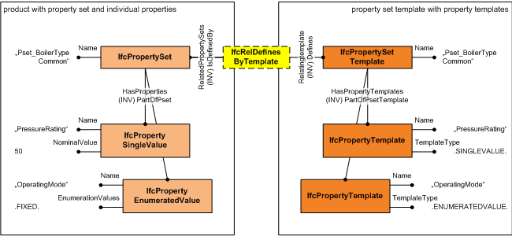

The _IfcSimplePropertyTemplate_ defines the template for all dynamically extensible properties, either the subtypes of _IfcSimpleProperty_, or the subtypes of _IfcPhysicalSimpleQuantity_. The individual property templates are interpreted according to their _Name_ attribute and may have a predefined template type, property units, and property measure types. The correct interpretation of the attributes:

* _PrimaryUnit_
* _SecondaryUnit_
* _PrimaryMeasureType_
* _SecondaryMeasureType_

is determined by the _TemplateType_. The attributes Enumerators and Expression only apply to instances of _IfcSimplePropertyTemplate_ having a particular _TemplateType_. The _TemplateType_ also controls, which subtype of either _IfcSimpleProperty_ or _IfcPhysicalSimpleQuantity_ shall be used for property occurrences corresponding to this template.

The _IfcSimplePropertyTemplate_ is part of the set of templates included in the _IfcPropertySetTemplate_. The template can be accessed throught the inverse attribute _PartOfPsetTemplate_ The _IfcPropertySetTemplate_ may define one or several instances of _IfcPropertySet_ (or _IfcElementQuantity_). The definition assignment is established by the objectified relationship _IfcRelDefinesByTemplate_ as shown in Figure 1. There is no direct link between an _IfcSimplePropertyTemplate_ and a subtype of either _IfcSimpleProperty_ or _IfcPhysicalSimpleQuantity_. The definition relationship between the template and the individual properties (or quantities) is established by the _Name_ attributes.

> NOTE&nbsp; Constraints at _IfcPropertySetTemplate_ and _IfcPropertySet_ (and _IfcElementQuantity_) guarantee that the _Name_ attributes of included property templates and individual properties are unique.

> HISTORY&nbsp; New entity in IFC4.
