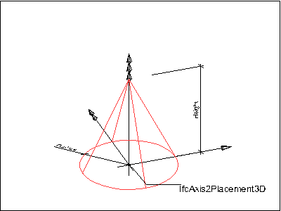

The _IfcRightCircularCone_ is a Construction Solid Geometry (CSG) 3D primitive. It is a solid with a circular base and a point called apex as the top. The tapers from the base to the top. The axis from the center of the circular base to the apex is perpendicular to the base. The inherited _Position_ attribute defines the _IfcAxisPlacement3D_ and provides the location and orientation of the cone:

* _SELF\IfcCsgPrimitive3D.Position_: The location and orientation of the axis system for the primitive.&nbsp;
* _SELF\IfcCsgPrimitive3D.Position.Location_: The center of the circular area being the bottom face of the cone.
* _SELF\IfcCsgPrimitive3D.Position.Position[3]:_ The z-axis of the inherited placement coordinate system provides the center axis of the _IfcRightCircularCone_, and the apex is at the _Height_ value applied to the positive direction of the z-axis. The _BottomRadius_ defines the circular base at the xy-plane of the placement coordinate system.

Figure 1 illustrates geometric parameters of the cone. The cone is positioned within its own placement coordinate system. The origin is the center of the bottom circular disk, that lies in the XY plane. The apex lies on the positive z axis at [0, 0, _Height_].

> NOTE&nbsp; Entity adapted from **right_circular_cone** defined in ISO 10303-42.

> HISTORY&nbsp; New entity in IFC2x3

{ .use-head}
Texture use definition

On the circular side, textures are aligned facing upright with origin at the back (+Y direction) revolving counter-clockwise. Textures are stretched or repeated to the extent of the base circumference according to RepeatS. Textures are compressed linearly going upwards towards the top point according to RepeatT.

On the bottom face, textures are aligned facing front-to-back, with the center of the circle aligned to the center of the texture.

Figure 2 illustrates default texture mapping with a clamped texture (RepeatS=False and RepeatT=False). The image on the left shows the texture where the S axis points to the right and the T axis points up. The image on the right shows the texture applied to the geometry where the X axis points back to the right, the Y axis points back to the left, and the Z axis points up.

{ .gridtable}
<table summary="texture" class="gridtable">
<tr><td></td></tr>
<tr><td>
<table summary="texture" width="512" class="gridtable">
<tr>
<th>Side</th>
<th>Normal</th>
<th>Origin&nbsp;X</th>
<th>Origin&nbsp;Y</th>
<th>Origin&nbsp;Z</th>
<th>S&nbsp;Axis</th>
<th>T&nbsp;Axis</th>
</tr>
<tr>
<td>Side</td>
<td>+Y</td>
<td>0</td>
<td>+Radius</td>
<td>0</td>
<td>-X</td>
<td>(towards top point)</td>
</tr>
<tr>
<td>Bottom</td>
<td>-Z</td>
<td>-Radius</td>
<td>+Radius</td>
<td>0</td>
<td>+X</td>
<td>-Y</td>
</tr>
</table>
</td></tr>
<tr><td>
Figure 2 &mdash; Right circular cone textures
</td></tr>
</table>
