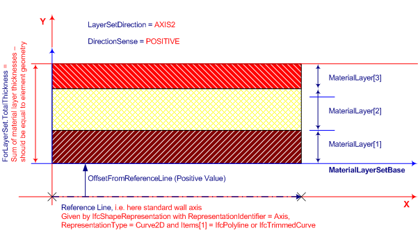
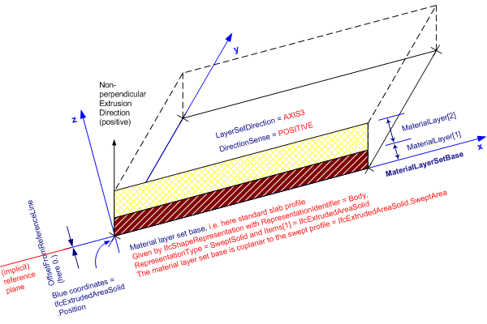

The _IfcMaterialLayerSetUsage_ determines the usage of _IfcMaterialLayerSet_ in terms of its location and orientation relative to the associated element geometry. The location of material layer set shall be compatible with the building element geometry (that is, material layers shall fit inside the element geometry). The rules to ensure the compatibility depend on the type of the building element.

> EXAMPLE&nbsp; For a cavity brick wall with shape representation SweptSolid, the _IfcMaterialLayerSet.TotalThickness_ shall be equal to the wall thickness. Also the _OffsetFromReferenceLine_ shall match the exact positions between the two shape representations of _IfcWallStandardCase_, that is the _IfcShapeRepresentation_'s with _RepresentationIdentifier_="Axis" and _RepresentationIdentifier_="Body".

> NOTE&nbsp; Model view definitions or implementer agreements may provide more instructions on matching between building element geometry and material layer set usage.

The _IfcMaterialLayerSetUsage_ is always assigned to an individual occurrence object (and only to relevant subtypes of _IfcElement_). The _IfcMaterialLayerSet_, referenced by _ForLayerSet_, can however be shared among several occurrence objects. If the element type is available (in other words, an instance of the relevant subtype of _IfcElementType_ exists), then the _IfcMaterialLayerSet_ can be assigned to the element type. The assignment between a subtype of _IfcElement_ and the _IfcMaterialLayerSetUsage_ is handled by _IfcRelAssociatesMaterial_.

{ .use-head}
Attribute use definition

The _IfcMaterialLayerSetUsage_ is primarily intended to be associated with planar building elements having a constant thickness. With further agreements on the interpretation of _LayerSetDirection_, the usage can be extended also to other cases, for example to curved building elements, provided that the material layer thicknesses are constant.

Generally, an element may be layered in any of its primary directions, denoted by its x, y or z axis. The geometry use definitions at each specific type of building element will determine the applicable _LayerSetDirection_.

The following examples illustrate how the _IfcMaterialLayerSetUsage_ attributes (_LayerSetDirection_, _DirectionSense_, _OffsetFromReferenceLine_) can be used in different cases. Normative material use definitions are documented at each element (how these shall be used).

Figure 1 shows an example of the use of _IfcMaterialLayerSetUsage_ aligned to the axis of a wall.

> EXAMPLE&nbsp; For a standard wall with extruded geometric representation (vertical extrusion), the layer set direction will be perpendicular to extrusion direction, and can be derived from the direction of the wall axis. With the_DirectionSense_ (positive in this example) the individual _IfcMaterialLayers_ are assigned consecutively right-to-left or left-to-right. For a curved wall, "direction denoting the wall thickness" can be derived from the direction of the wall axis, and it will remain perpendicular to the wall path. The _DirectionSense_ applies as well.

> NOTE&nbsp; According to the _IfcWallStandardCase_ material use definition the _LayerSetDirection_ for _IfcWallStandardCase_ is always AXIS2 (that is, along the y-axis), as shown in this example.

Figure 2 shows an example of the use of _IfcMaterialLayerSetUsage_ aligned to a slab.

> EXAMPLE&nbsp; For a slab with perpendicular extruded geometric representation, the _LayerSetDirection_ will coincide with the extrusion direction (in positive or negative sense). In this example, the material layer set base is the extruded profile and consistent with the _IfcExtrudedAreaSolid.Position_, with the _DirectionSense_ being positive, the individual _IfcMaterialLayers_ are built up from the base towards the positive z direction in this case.

> NOTE&nbsp; According to the _IfcSlabStandardCase_ material use definition the _LayerSetDirection_ for _IfcSlabStandardCase_ is always AXIS3 (that is, along the z-axis).

Figure 3 shows an example of the use of _IfcMaterialLayerSetUsage_ aligned to a roof slab with non-perpendicular extrusion.

> EXAMPLE&nbsp; For a slab with non-perpendicular extruded geometric representation, the guidelines above apply as well<small>. The material layer thickness and the <em>OffsetFromReferenceLine</em> are always measured
perpendicularly, even if the extrusion direction is not perpendicular. Therefore the total material layer thickness is
not equal to the extrusion depth of the geometry.</small>

