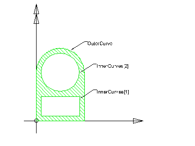

The _IfcArbitraryProfileDefWithVoids_ defines an arbitrary closed two-dimensional profile with holes. It is given by an outer boundary and inner boundaries. A common usage of _IfcArbitraryProfileDefWithVoids_ is as the cross section for the creation of swept surfaces or swept solids.

> HISTORY&nbsp; New entity in IFC2x.

{ .spec-head}
Informal Propositions:

1. The outer curve and all inner curves shall be closed curves.
2. The outer curve shall enclose all inner curves.
3. No inner curve shall intersect with the outer curve or any other inner curve. That is, no two curves of the profile definition shall have a point or segment in common, taken into account the geometric precision factor of the geometric representation context. In other words, curves must neither cross nor touch each other.
4. No inner curve may enclose another inner curve.

Figure 1 illustrates the arbitrary closed profile definition with voids. The _OuterCurve_, defined at the supertype _IfcArbitraryClosedProfileDef_ and the inner curves are defined in the same underlying coordinate system. The common underlying coordinate system is defined by the swept area solid that uses the profile definition. It is the xy plane of:

* _IfcSweptAreaSolid.Position_

or in case of sectioned spines the xy plane of each list member of _IfcSectionedSpine.CrossSectionPositions_. The _OuterCurve_ attribute defines a two dimensional closed bounded curve, the _InnerCurves_ define a set of two dimensional closed bounded curves.

