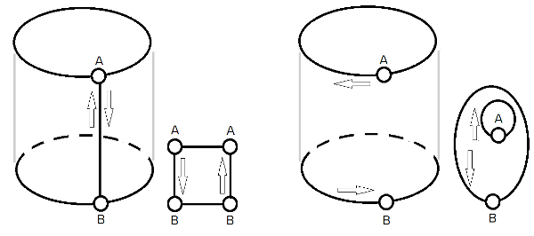

An advanced face is a specialization of a face surface that has to meet requirements on using particular topological and geometric representation items for the definition of the faces, edges and vertices.

An _IfcAdvancedFace_ is restricted to:

* have a face surface geometry of type _IfcElementarySurface_, _IfcSweptSurface_ or _IfcBSplineSurface_,
* have one _IfcFaceOuterBound_ as the bound of the face, with the exception of closed surfaces,
* have all faces to be bound by _IfcEdgeLoop_ or _IfcVertexLoop_,
* have all edges to have an edge curve geometry,
* have the edge curve geometry restricted to _IfcLine_, _IfcConic_, _IfcPolyline_, or _IfcBSplineCurve_

In case of closed faces with periodic surfaces, such as cylindrical or spherical surfaces, the following applies:

* the edges of the closed surface, in case of a cylindrical surface the upper and lower cap, refer to the same instance of _IfcVertexPoint_ twice,
* no _IfcFaceOuterBound_ is provided, or the _IfcFaceOuterBound_ is constructed using an _IfcSeamCurve_ at the periodic end of the underlying closed surface, in case of a cylindrical surface at 0./360. degree.

> NOTE&nbsp; Entity adapted from **advanced_face** defined in ISO 10303-511.

> HISTORY&nbsp; New entity in IFC4
